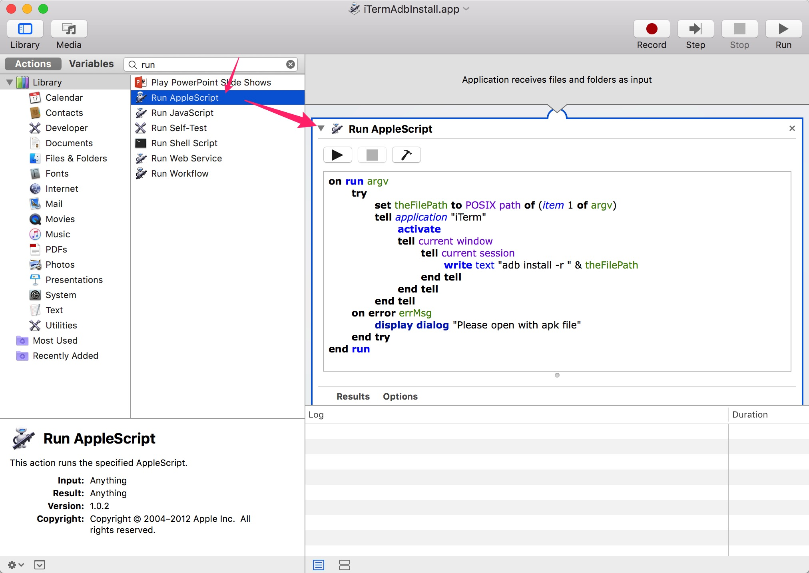
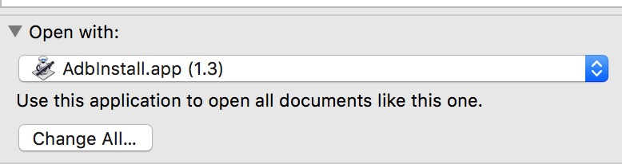

# Mac apk installer

## Prerequisite

* adb
* Terminal or iTerm2

## I'm lazy

Just download `iTermAdbInstall.app` or `TerminalAdbInstall.app` from release.

## Manually

### 1. Automator -> File(new) -> Application

### 2. AppleScript

Make sure `adb` command is available from your terminal.

#### iTerm

```applescript
on run argv
    try
        set theFilePath to POSIX path of (item 1 of argv)
        tell application "iTerm"
            activate
            tell current window
                tell current session
                    write text "adb install -r " & theFilePath
                end tell
            end tell
        end tell
    on error errMsg
        display dialog "Please open with apk file"
    end try
end run
```

#### Terminal

```applescript
on run argv
    try
        set theFilePath to POSIX path of (item 1 of argv)
        tell application "Terminal"
            if not (exists window 1) then reopen
            activate
            do script ("adb install -r " & theFilePath) in window 1
        end tell
    on error errMsg
        display dialog "Please open with apk file"
    end try
end run
```



### 3. Save as xxx.app

### 4. Set apk open with xxx.app

