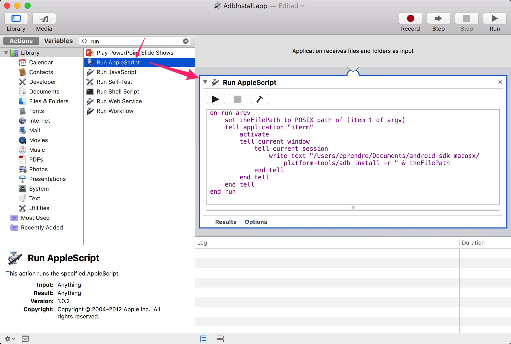

# Mac apk installer

## Prerequisite

* adb
* Terminal or iTerm2

## 1. Automator -> File(new) -> Application

## 2. AppleScript

Replace adb with your own path

### iTerm

```applescript
on run argv
    set theFilePath to POSIX path of (item 1 of argv)
    tell application "iTerm"
        activate
        tell current window
            tell current session
                write text "/Users/eprendre/Documents/android-sdk-macosx/platform-tools/adb install -r " & theFilePath
            end tell
        end tell
    end tell
end run
```

### Terminal

```applescript
on run argv
    set theFilePath to POSIX path of (item 1 of argv)
    tell application "Terminal"
        activate
        do script ("/Users/eprendre/Documents/android-sdk-macosx/platform-tools/adb install -r " & theFilePath)
    end tell
end run
```



## 3. Save as xxx.app

## 4. Set apk open with xxx.app

